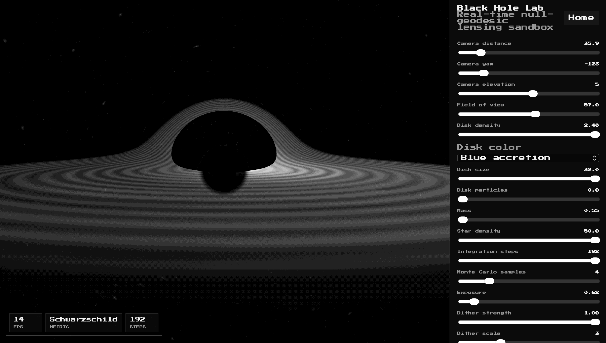
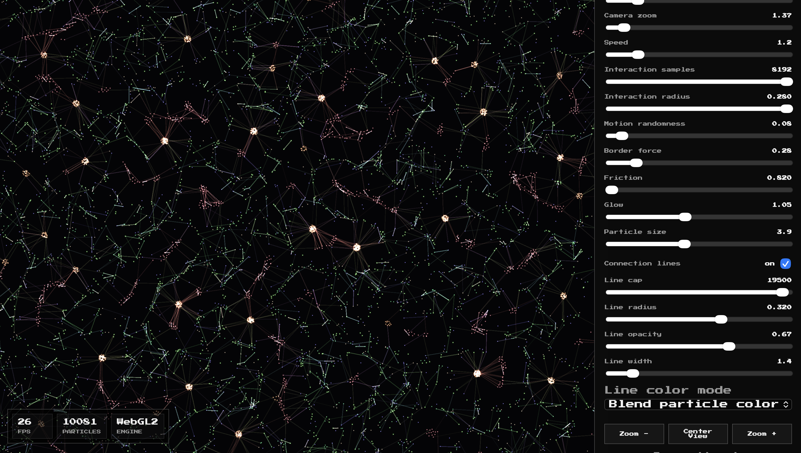

# ParticleLife

ParticleLife is a small collection of free, local, browser-based WebGL simulations.

It currently includes:

- **Particle Life**: a GPU-accelerated particle ecosystem with editable rule matrices, density control, particle types, connection lines, camera movement, and visual themes.
- **Black Hole Lab**: a realtime Schwarzschild-inspired black-hole renderer with orbit camera controls, accretion disk tuning, star fields, color palettes, mass control, and dithering modes.

Everything runs in your browser. There is no build step, no paid API, no backend, and no network dependency after the files are loaded.





## What You Need

You only need:

- A modern browser with WebGL2 support.
- Python 3, or any other static-file server.
- Git, only if you want to clone the repository from GitHub.

You do **not** need Node, npm, Vite, Webpack, a database, an API key, or any account.

## Run It

Clone the repo:

```sh
git clone https://github.com/MarioPaerle/ParticleLife.git
cd ParticleLife
```

Start a tiny local server:

```sh
python3 -m http.server 4173 --bind 127.0.0.1
```

Open:

```text
http://127.0.0.1:4173/
```

The home page lets you choose between Particle Life and Black Hole Lab.

Direct links:

- `http://127.0.0.1:4173/particlelife.html`
- `http://127.0.0.1:4173/blackhole.html`

On Windows, this command may be:

```sh
py -m http.server 4173 --bind 127.0.0.1
```

If you prefer another server, that is fine too. The project is just static files.

## Why A Local Server?

Opening `index.html` directly from the file system can break browser module imports on some machines. Running a local static server avoids that and behaves like normal web hosting.

## Particle Life

Particle Life simulates many colored particles interacting through a rule matrix. Each particle has a type. The matrix decides whether one type attracts or repels another type.

The simulation stores particle state on the GPU and updates it with WebGL2 shaders, so it can handle large counts while keeping the CPU mostly free.

Main controls:

- `Particles`: number of simulated particles, up to 50,000.
- `Types`: number of particle species, up to 75.
- `Rule Matrix`: editable attraction/repulsion table.
- `Prompt or matrix`: type a prompt for deterministic generated rules, or paste a JSON matrix.
- `Neighbor density`: target number of particles inside the interaction radius.
- `World size`: size of the 2D plane.
- `Camera zoom`: zoom in and out.
- `Speed`: simulation-time multiplier using fixed substeps.
- `Interaction samples`: GPU sample budget for approximate pairwise forces.
- `Interaction radius`: maximum distance for forces.
- `Motion randomness`: movement jitter.
- `Border force`: soft wall strength. At zero, the world wraps; above zero, it becomes bounded.
- `Connection lines`: draws capped particle-to-particle lines.
- `Line color mode`: blend particle colors, source color, or rule color.

Mouse controls:

- Drag the canvas to pan.
- Use the mouse wheel to zoom.
- Use `Center View` to reset the camera.

## Black Hole Lab

Black Hole Lab is a realtime black-hole visual sandbox. It is not an offline scientific renderer, but it uses a coherent realtime model: rays bend toward the mass, captured rays disappear into the horizon, and disk light is accumulated while the ray march crosses the accretion disk.

It includes:

- Horizon occlusion.
- Photon-ring and critical-impact cues.
- Doppler-style disk brightness asymmetry.
- Smooth procedural stars.
- Selectable disk color palettes.
- Granular hot disk particles.
- Mass control.
- Disk size and density control.
- Dithering modes inspired by retro and pixel tools.

Main controls:

- `Camera distance`: move toward or away from the black hole.
- `Camera yaw`: orbit left/right.
- `Camera elevation`: orbit up/down.
- `Field of view`: widen or tighten the camera lens.
- `Disk density`: brightness and opacity of the disk.
- `Disk color`: choose the disk palette.
- `Disk size`: outer radius of the accretion disk.
- `Disk particles`: amount of hot granular disk structure.
- `Mass`: scales the horizon, photon sphere, redshift, and bending strength.
- `Star density`: amount of background stars.
- `Integration steps`: ray-march quality/cost.
- `Monte Carlo samples`: per-pixel jitter samples.
- `Exposure`: final brightness.
- `Dither strength`, `Dither scale`, `Dither levels`: dither look controls.
- `Dither mode`: Off, Bayer 4x4, Dithering Boy, mono ordered, Bayer 8x8, blue noise, halftone mono, or scanline mono.

Mouse controls:

- Drag the canvas to orbit the camera.
- Use the mouse wheel to change camera distance.

## Platform Support

This is not macOS-only.

It should run on any operating system with a modern WebGL2 browser:

- macOS with Chrome, Edge, Firefox, or recent Safari.
- Windows with Chrome, Edge, or Firefox.
- Linux with Chrome, Chromium, or Firefox.
- Some Android browsers, depending on WebGL2 support and GPU capability.

For very high particle counts, high black-hole integration steps, or high Monte Carlo samples, performance depends heavily on the GPU.

## Rule Matrix Format

The Particle Life rule matrix is indexed as:

```js
matrix[actorType][neighborType]
```

- Positive values attract.
- Negative values repel.
- Values should stay between `-1` and `1`.

You can paste JSON directly into the prompt field:

```json
[[0.2, -0.7], [0.8, -0.1]]
```

If you type prose instead, ParticleLife hashes the prompt into deterministic rules. The same prompt gives the same matrix.

## Project Structure

```text
.
├── index.html
├── particlelife.html
├── blackhole.html
├── home.css
├── styles.css
├── blackhole.css
├── assets
│   ├── fonts
│   │   ├── NOTICE.md
│   │   └── press-start-2p.ttf
│   └── screenshots
│       ├── black-hole-lab.png
│       └── particle-life.png
└── src
    ├── app.js
    ├── gpu-particle-life.js
    ├── rules.js
    ├── black-hole-app.js
    └── black-hole-renderer.js
```

## Notes

- The UI is intentionally black and white with a pixel font.
- The simulations themselves can be colorful.
- The font is self-hosted so the app keeps working offline after the files are loaded.
- `press-start-2p.ttf` is Press Start 2P from Google Fonts, distributed under the SIL Open Font License.

## License

MIT License. See `LICENSE`.
